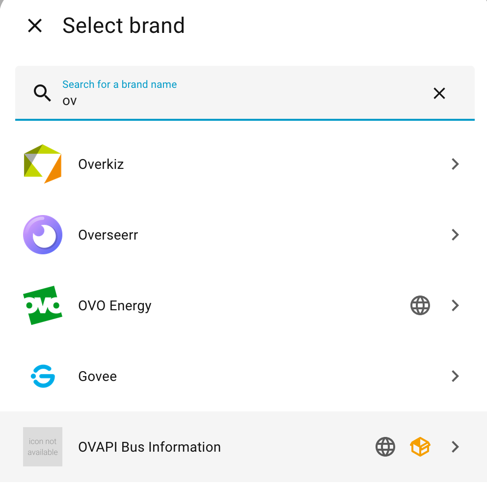
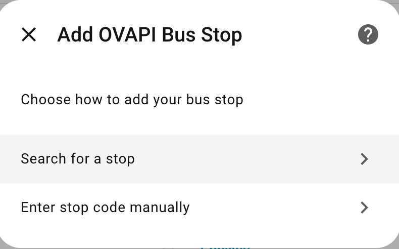
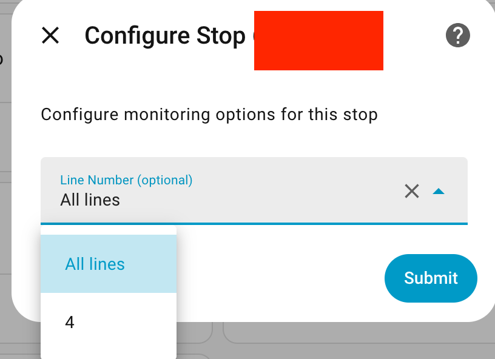
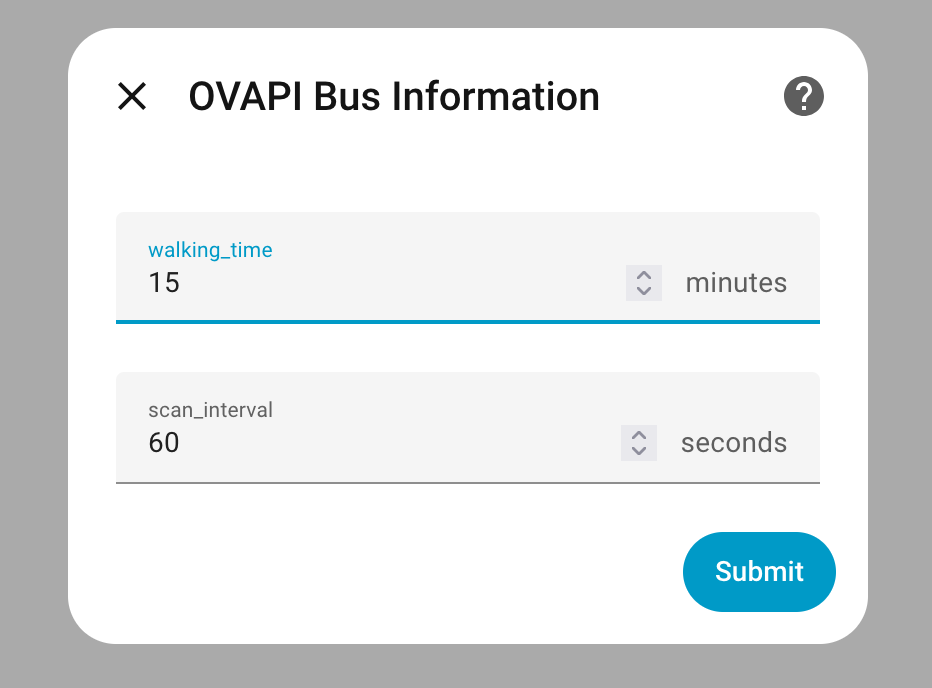
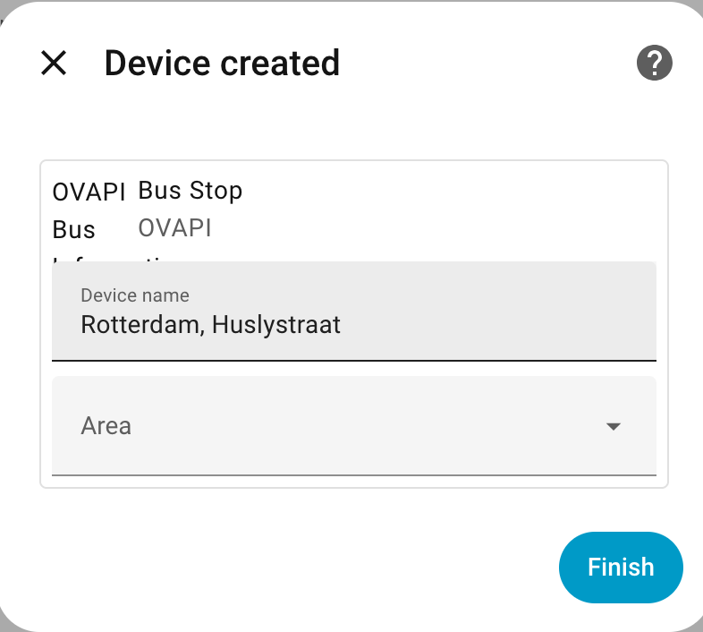
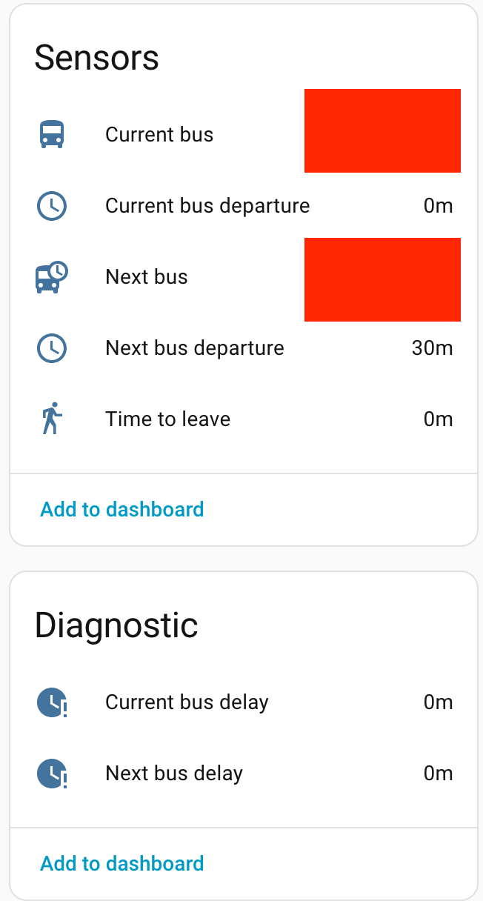

# OVAPI Bus Information for Home Assistant

A custom Home Assistant integration that provides real-time bus information from OVAPI.nl (Dutch public transport API). This integration allows you to monitor bus arrivals, track delays, and plan when to leave home to catch your bus.

## Features

- 🔍 **Stop Search**: Search for bus stops by name or location using GTFS data
- 🔄 **Bidirectional Monitoring**: Monitor buses from both directions at a stop (combined next bus view)
- 🚌 **Current Bus**: Shows the next arriving bus with line number and destination
- 🚌 **Next Bus**: Displays information about the bus after the current one
- ⏱️ **Delay Tracking**: Monitors delays for both current and next buses
- 🚶 **Walking Planner**: Calculates when you need to leave based on your walking time
- ⏰ **Departure Times**: Shows minutes until bus departures
- 🔄 **Configurable Updates**: Set update interval between 60-300 seconds (default: 60s)
- 🎛️ **UI Configuration**: Easy setup through Home Assistant UI

## Installation

### Manual Installation

1. Copy the `custom_components/ovapi` folder to your Home Assistant's `custom_components` directory:
   ```
   /config/custom_components/ovapi/
   ```

2. Restart Home Assistant

3. Go to **Configuration** → **Integrations** → **Add Integration**

4. Search for "OVAPI Bus Information" and follow the setup wizard

### HACS Installation (Future)

This integration is not yet available in HACS but can be added as a custom repository.

## Screenshots

### Configuration Flow

The integration provides an easy-to-use configuration interface:

**Step 1: Choose integragion** 



**Step 2: Choose search type**



**Step 3: Search for Stop**


 
**Step 4: Select Stop from Results**


**Step 5: Configure Line Filter**



**Step 5: Configure options**



**Step 6: Configure entity**



**Result: Integration Added**



## Configuration

### Through the UI (Recommended)

1. Go to **Configuration** → **Integrations**
2. Click the **+ Add Integration** button
3. Search for "OVAPI Bus Information"
4. Choose your setup method:
   - **Search for a stop**: Search by stop name or location (easiest method)
   - **Enter stop code manually**: If you already know your stop code

#### Option 1: Search for a Stop
1. Enter a search query (e.g., "Amsterdam Centraal", "Stationsplein", etc.)
2. Select your stop from the search results
3. **Choose Direction** (if multiple directions available):
   - **Both directions (combined)**: Monitor buses from both directions - shows the next bus from either direction
   - **Specific direction**: Choose one direction only (e.g., "Direction: City Center")
4. Configure the monitoring options:
   - **Line Number** (optional): Filter for a specific bus line (e.g., "22")
   - **Destination Filter** (optional): Filter by destination name (automatically set to "All destinations" when monitoring both directions)
   - **Walking Time**: How many minutes it takes you to walk to the stop (default: 5)
   - **Update Interval**: How often to check for updates in seconds (default: 60, range: 60-300)

#### Option 2: Manual Entry
1. Enter your stop code (e.g., "31000495")
2. Configure the same monitoring options as above

### Finding Your Stop Code (Manual Entry)

If you prefer manual entry, find your stop code by:

1. Using the built-in search feature (recommended!)
2. Visiting [OVAPI.nl](http://ovapi.nl/)
3. Checking your local transit app or website for the stop code
4. Looking at physical signage at the bus stop (sometimes displayed)

## Sensors

The integration creates the following sensors for each configured bus stop:

| Sensor | Description | Unit |
|--------|-------------|------|
| `sensor.<stop>_current_bus` | Next arriving bus (line → destination) | - |
| `sensor.<stop>_next_bus` | Bus after the current one | - |
| `sensor.<stop>_current_bus_delay` | Delay of the current bus | minutes |
| `sensor.<stop>_next_bus_delay` | Delay of the next bus | minutes |
| `sensor.<stop>_current_bus_departure` | Minutes until current bus arrives | minutes |
| `sensor.<stop>_next_bus_departure` | Minutes until next bus arrives | minutes |
| `sensor.<stop>_time_to_leave` | When you should start walking | minutes |

### Sensor Attributes

Each sensor includes additional attributes with detailed information:

**Current/Next Bus sensors:**
- `line_number`: Bus line number
- `destination`: Destination name
- `expected_arrival`: Expected arrival time (ISO format)
- `target_arrival`: Scheduled arrival time (ISO format)
- `delay_minutes`: Delay in minutes
- `transport_type`: Type of transport
- `minutes_until_departure`: Minutes until arrival

**Time to Leave sensor:**
- `walking_time_minutes`: Your configured walking time
- `bus_arrival_minutes`: Minutes until bus arrives
- `should_leave_now`: Boolean indicating if you should leave now
- `bus_line`: Line number of the bus
- `bus_destination`: Destination of the bus

## Example Automations

### Notification When to Leave

```yaml
automation:
  - alias: "Notify when to leave for bus"
    trigger:
      - platform: numeric_state
        entity_id: sensor.bus_stop_31000495_time_to_leave
        below: 2
    condition:
      - condition: state
        entity_id: binary_sensor.someone_home
        state: "on"
    action:
      - service: notify.mobile_app
        data:
          title: "Time to catch the bus!"
          message: "Leave now to catch bus {{ state_attr('sensor.bus_stop_31000495_current_bus', 'line_number') }}"
```

### Alert for Delays

```yaml
automation:
  - alias: "Alert for bus delays"
    trigger:
      - platform: numeric_state
        entity_id: sensor.bus_stop_31000495_current_bus_delay
        above: 5
    action:
      - service: notify.mobile_app
        data:
          title: "Bus Delayed"
          message: "Your bus is delayed by {{ states('sensor.bus_stop_31000495_current_bus_delay') }} minutes"
```

### Dashboard Card Example

```yaml
type: entities
title: Bus Stop
entities:
  - entity: sensor.bus_stop_31000495_current_bus
    name: Next Bus
  - entity: sensor.bus_stop_31000495_current_bus_departure
    name: Arrives in
  - entity: sensor.bus_stop_31000495_current_bus_delay
    name: Delay
  - entity: sensor.bus_stop_31000495_time_to_leave
    name: Leave in
  - entity: sensor.bus_stop_31000495_next_bus
    name: Following Bus
  - entity: sensor.bus_stop_31000495_next_bus_departure
    name: Arrives in
```

## Troubleshooting

### No data showing

- Verify your stop code is correct
- Check that the stop has active bus services
- Look at the Home Assistant logs for error messages
- Ensure your Home Assistant can reach ovapi.nl (check firewall/network settings)

### Stop not found in search

- **Not all stops with real-time data are in the GTFS search database**
- Example: Rotterdam Huslystraat (stop code 31002742) has real-time data but isn't in GTFS
- **Solution**: Use **manual entry** with the stop code instead of search
- You can find stop codes on physical signage at stops or transit apps

### Sensors show "Unknown"

- The bus line might not be running at the current time
- Check if your filters (line number, destination) are too restrictive
- Verify that buses are actually scheduled at this time
- If monitoring both directions, ensure both stop codes are valid

### Only one direction showing

- If you selected "Both directions" but only see one, check that:
  - Both stop codes exist in the GTFS data (some stops may only have one direction)
  - The GTFS cache is up to date (delete cache file in `.storage/ovapi_gtfs_cache.json` if needed)
  - Both directions have active bus services at the current time

### Connection errors

- OVAPI.nl might be temporarily unavailable
- Check your internet connection
- The integration will automatically retry

## API Information

This integration uses the [OVAPI.nl](http://ovapi.nl/) API, which provides real-time public transport information for the Netherlands. The API is free to use and doesn't require an API key.

**Update Frequency**: Data is fetched every 60 seconds by default.

## Contributing

Contributions are welcome! Please feel free to submit a Pull Request.

## License

This project is licensed under the Apache 2.0 License.

## Disclaimer

This is an unofficial integration and is not affiliated with OVAPI.nl or any public transport providers. Use at your own risk.

## To-do for becomming a real integration: 
- Icon assets (256x256 or 512x512 png)
- Documentation on the HA docs repo (separate from README)